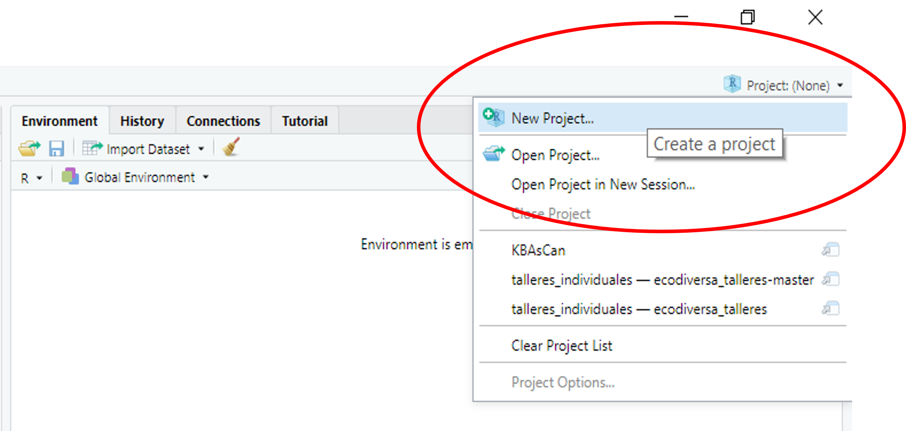

<center><h2><span style="color:#3399FF">Ecodiversa </span> <span style="color:green">Tropical</span></h2> </center>


```{r setup, include=FALSE}
knitr::opts_chunk$set(echo = TRUE)
setwd("C:/Talleres_Ecodiversa_R/IntroR_Configurar")

```
___

# Objetivos de aprendizaje

Al final de este taller usted podrá:

+ Crear carpetas
+ Configurar directorio de trabajo
+ Salvar código en R
+ Crear un proyecto
+ Crear rutas absoluta y relativa


# Para empezar

Inicie R Studio y abra un nuevo R Script utilizando el menu: *File* > *New File* > *R Script*


# Configuración

## ¿Cual es la carpeta en donde estoy actualmente?

Cuando usted inicia una sesion, R se conecta por defecto a una carpeta en su computador. 

Es bueno saber desde un comienzo en qué carpeta (directorio) está usted trabajando actualmente en R.

Para esto vamos a utilizar las siguientes funciones: `getwd()`.

`getwd()`:  es una función que le permite obtener la ruta completa de la carpeta actual de trabajo (wd, se refiere a 'working directory' por sus siglas en inglés). 

En mi caso estamos ubicados en la carpeta que se muestra después de ejecutar el código. Para usted puede ser otra carpeta.


```{r }

getwd()

```

<div style="padding: 15px; border: 1px solid transparent; border-color: transparent; margin-bottom: 20px; border-radius: 4px; color: #31708f; background-color: #d9edf7; border-color: #bce8f1;">
**<span style="color:blue">Tips!</span>** 

Note que la barra inclinada en R es "/", totalmente opuesta a la que usted encuentra en su explorador "\\".
</div>


## Quiero crear un carpeta


Ahora usted quiere crear un directorio para guadar el archivo en R que contiene sus códigos.

Para esto vamos a utilizar las siguiente función: `dir.create()`


```{r}

dir.create("C:/Intro_Test")


```


<div style="padding: 15px; border: 1px solid transparent; border-color: transparent; margin-bottom: 20px; border-radius: 4px; color: #a94442; background-color: #f2dede; border-color: #ebccd1;">
**<span style="color:red">Avisos!</span>** 

Si el directorio ya existe usted puede obtener este mensaje:

<span style="color:red">"'C:\\Intro_Test'" already exists</span> 

... No se precopupe, su carpeta no se borrará...

</div>


## Quiero configurar una carpeta de trabajo

Si quiere configurar esta carpeta como directiorio de trabajo 'C:/Intro_Test' al que R siempre busca para cargar o guardar archivos, entonces utilice la siguiente función:

`setwd()`: configurar el directorio de trabajo


```{r warning=FALSE}

setwd("C:/Intro_Test")

getwd() # obtenga nuevamente el directorio en el cual está trabajando

```


## Ejercicio

Ahora que usted está en esta carpeta, es su turno de practicar:

<div style="padding: 15px; border: 1px solid transparent; border-color: transparent; margin-bottom: 20px; border-radius: 4px; color: #8a6d3b;; background-color: #fcf8e3; border-color: #faebcc;">
**<span style="color:brown">Ejercicio!</span>** 

Puede crear dos carpetas dentro de este carpeta: "C:/Intro_Test", llamados:

+ Datos1
+ datos1


¿Cuáles son los resultados?

</div>


## Listar carpetas dentro de un carpeta

Para saber cuáles son los carpetas que están dentro de "C:/Intro_Test" vamos a utilizar la función `list.dirs`.


```{r warning=FALSE}

list.dirs("C:/Intro_Test")


```


# Salvar sus códigos

Para salvar su archivo pude utilizar el menu:

File > Save as > "mi_primer_codigo.R" (no utilice tildes y use barra al piso para separar palabras)


{width=50% height="50%"}


# Crear un Proyecto

Ahora bien, usted puede crear un **Proyecto** en R Studio, que le permitirá acceder a todos los archivos relacionados con el proyecto, tener una historia de lo que ha desarrollado y abrir el ambiente de trabajo si decide cerrar y volver en un par de días a revisitar lo que ha hecho. Más adelante vera lo conveniente de todas estas características. 

Creemos un nuevo proyecto. Para esto hay dos formas:

Vaya al menu y utilice File > New Project  

{width=50% height="50%"}
<br>

O en la parte derecha superior en donde aparece Project(none), seleccione "New Project".

{width=50% height="50%"}


En los pantallazos que aparecen seleccione "New directory", despues "New Project" y finalmente guarde este proyecto con el nombre de la carpeta que ha creado anteriormente "C:/Intro_Test".

Nota: Puede utilizar el mismo proceso para crear nuevos proyectos (por ejemplo, capítulos de su tesis).


{width=40% height="40%"}

{width=40% height="40%"}

{width=40% height="40%"}


Como resultado obtendrá un pantallazo con el nuevo proyecto.  Note que en el panel inferior derecho de R Studio aparecen los archivos que están dentro de este carpeta, con el nombre del nuevo proyecto.

Además en la parte superior derecha e izquierda de su pantalla de R Studio se hace referencia a este proyecto.  Es decir el proyecto está abierto y activo.

Puede abrir sus códigos puede darle click al cubo que representa el proyecto "Intro_Test.Rproj". Lo mismo puede hacer desde su exploraor en Windows.

{width=100% height="80%"}

<br>

Si usted abre Windows Explorer podra ver un archivo de texto ".Rhistory" que guarda los códigos ejecutados en el archivo de R.

{width=100% height="80%"}

<br>

# Rutas absolutas y relativas


La **ruta absoluta** (absolute path, en inglés) contiene la localización **COMPLETA** de su archivo o carpeta.

Por ejemplo: "C:/Intro_Test" (en este caso se hace referencia al disco duro C:/ de mi computador y la carpeta es "Intro_Test").

Vamos a utilizar la función `list.files()` para listar los archivos que se encuentran dentro de la carpeta "C:/Intro_Test".

```{r warning=FALSE}

list.files("C:/Intro_Test")


```

<br>

La **ruta relativa** (relative paths, en inglés) contiene la localización **PARCIAL** de su archivo o carpeta.

Es muy útil cuando usted ha definido la carpeta de trabajo al principio de su código. Recuerda? Cuando utilizó la función `setwd()`.

Por ejemplo, "./" (en este caso usted ha configurado previamente la carpeta base de su proyecto, entonces no necesita escribir toda la ruta).


Las principales ventajas de utilizar la ruta relativa son:

+ puede ahorrar tiempo y evitar errorres escribiendo nuevamente toda la ruta en cada línea de su código
+ cuando comparte su código, sus colegas lo pueden reproducir fácilmente. 

En el código que se presenta abajo ya no tiene que escribir todo la ruta, es suficiente  con "./" (es decir la ruta relativa).

```{r warning=FALSE}

#list.files("./")


```


## Ejercicio


<div style="padding: 15px; border: 1px solid transparent; border-color: transparent; margin-bottom: 20px; border-radius: 4px; color: #8a6d3b;; background-color: #fcf8e3; border-color: #faebcc;">


Intente crear otra carpeta llamada "datos2" en la carpeta de trabajo "C:/Intro_Test", pero utilizando la ruta relativa

Explore la diferencia entre `list.files()` y `list.dirs()`.

</div>


<br>


